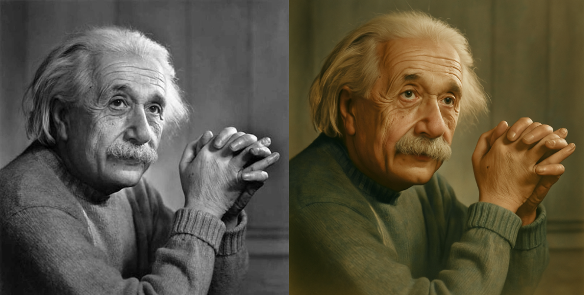
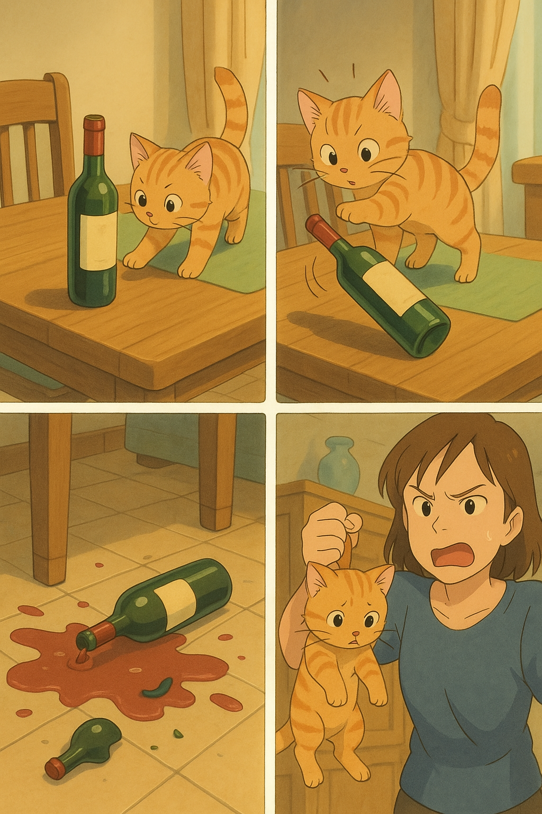
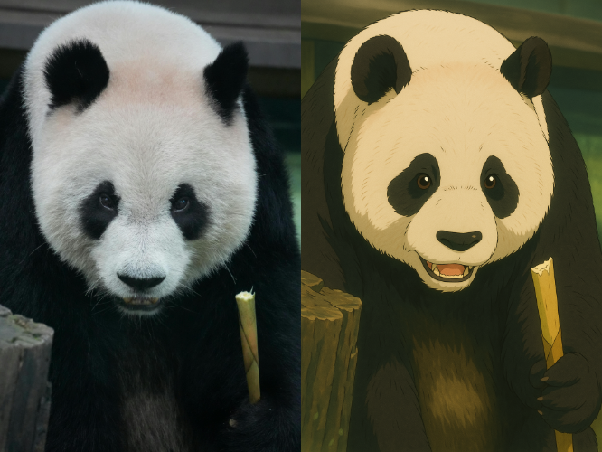

# 🖌️ 绘图提示词

## 绘制论文框图 SVG 格式

- **说明**：

  1. 生成的有些箭头指向错了怎么办，这个时候 我们就需要把 SVG 复制下来 导入到 [SVG 在线编辑器](https://www.jyshare.com/more/svgeditor/#delete)，然后人为的去修正，最后 AI 是死的，人是活的，具体怎么优化，怎么用，可以自己多思考思考
  2. 为什么要第十和十一条约束：思路很简单 箭头好加 但是不好改 框图就算乱了也是移动一下的事情。如果框图错位，鼠标移动一下的事情，但是箭头 SVG 要可视化去改动，还是比较麻烦的，特别是涉及到穿插的问题。
  3. 不好调的箭头直接砍掉，自己后面想办法加就是，或者不加都行，图一多，老师是不会扣你们这些细节的

- 💡 **提示词**：

  >请你根据附件代码生成多幅符合国内科研论文要求的 SVG 格式框图（内容自定 只要是符合附件代码内容 并且你觉得有必要的 都可以生成），具体要求如下：
  >1. 使用 10px 单位的网格系统对所有元素进行严格对齐，所有框体（使用 标签）必须按网格排列，保证水平和垂直间距统一且不重叠。
  >2. 每个框体内的文字需使用 Arial 字体，字号适中，确保文字完整可读。文字不得超过三行，并应与框体大小匹配。 
  >3. 箭头请使用 标签绘制。箭头路径必须先通过起点和终点坐标精确计算，再采用直线或平滑贝塞尔曲线绘制，确保箭头指向明确、路径平滑，绝不允许出现交叉、重叠、错位或重复指向同一目标的情况。 
  >4. 框图中所有元素应使用 标签进行分组管理，确保层次结构清晰。主流程节点和箭头分组明确，便于后续自动调整。
  >5. SVG 代码中必须内置碰撞检测及自动调整算法，若检测到框体、箭头或其他元素出现重叠、错位或碰撞现象，应自动调整其位置以保证整体布局稳定。
  >6. 颜色方面，请采用不超过 3 种主色调，框体边线统一且不宜过粗，背景应保持透明或采用浅色调，不得使用过于鲜艳的颜色以确保论文严谨风格。
  >7. 当框体内文字内容变化时，要求 SVG 具备自适应功能，能够自动重新计算框体尺寸与位置，确保整体布局不受影响。 
  >8. 图中避免形成循环依赖或闭环结构，保证流程清晰、层级分明。
  >9. 箭头指向框图内容的时候必须是垂直指向，必须要避免箭头交叉，每个箭头需要有足够长的距离长度保持美观，不要太紧凑，需要体现出箭头后面的引导线
  >10. 能走直线就不要走折线，前提是不会交叉以及穿过其他元素的；箭头能少就少，不要无脑加箭头，会乱格式，框图才是最重要的。
  >11. 每个箭头指向必须是框图的边框的正中间。
  >
  >请严格按照以上要求生成 SVG 框图，并确保所有细节均符合科研论文的严谨标准。

## 照片填色

- **说明**：以下经过 gpt-4o 进行的尝试，效果很好

- 💡 **提示词**：

  >请为老照片上色

- **效果示例**：

  

## 改变图片风格（吉卜力风格）

- **说明**：

  1. 上传图片后直接发以下三种提示词之一即可，同样采用 gpt-4o 进行的尝试

  2. 真人图片和动漫角色，效果都不错的。如果生成的动漫线条过于简单，也可以要求补充更多细节（如背景、服饰等）。

- 💡 **提示词**：

  >改为吉卜力风格
  >
  >convert to studio ghibli anime
  >
  >turn into ghibli cartoon style

- **效果示例**：

  

## 四格漫画

- **说明**：

  1. 同样采用 gpt-4o 进行的尝试

  2. 真人图片和动漫角色，效果都不错的。如果生成的动漫线条过于简单，也可以要求补充更多细节（如背景、服饰等）。

- 💡 **提示词**：

  >生成吉卜力风格的 4 格漫画：
  >
  >1. 小猫咪爬上餐桌看到餐桌边上有一个酒瓶
  >2. 它十分好奇，用爪子挠了一下酒瓶，瓶子开始倾倒
  >3. 酒瓶在地上碎了，酒水到处都是
  >4. 主人拎起小猫咪，严厉训斥

- **效果示例**：

  

## 人物插画

- **说明**：

  1. 同样采用 gpt-4o 进行的尝试

  2. 以下是连续提示词，借助大模型的上下文理解，可以实现风格的轻松同步。当频繁修改风格，且上下文过长时，可能会相互影响，很难保持稳定输出效果。

  3. 了保持更好的一致性，可以新开对话来保证上下文的简洁。GPT 在生成英文方面没有太大问题，中文则可能出现乱码字符

- 💡 **提示词**：

  >1. 改成吉卜力风格
  >
  >2. 调整画面为 16:9, 在侧面添加一段关于“爱因斯坦”的中英文对照介绍（英文为主，简体中文为辅），最佳排版效果
  >3. 继续生成，这张图是伽利略
  >
  >4. 继续，这是法拉第

- **效果示例**：

## LOGO 生成

直接描述特征即可，如“毛绒材质”、“渐变色毛玻璃”等

## 单词卡片

- **说明**：可以让学习变得轻松起来，很适合小朋友，场景潜力巨大

- 💡 **提示词**：

  >你是英语单词闪卡制作大师，可根据输入的主题词生成“吉卜力风格”图片并以此拓展。当我输入“电脑”时，你会生成一张与电脑相关的物品，并用箭头分步介绍键盘/鼠标/显示器等。包含英文/音标/中文。

- **效果示例**：

## 复古风海报

- **说明**：由 @dotey 提供，可以生成喜闻乐见的复古大海报

- 💡 **提示词**：

  >复古宣传海报风格，突出中文文字，背景为红黄放射状图案。画面中心位置有一位美丽的年轻女性，以精致复古风格绘制，面带微笑，气质优雅，具有亲和力。主题是 GPT 最新 AI 绘画服务的广告促销，强调‘惊爆价 9.9/张’、‘适用各种场景、图像融合、局部重绘’、‘每张提交 3 次修改’、‘AI 直出效果，无需修改’，底部醒目标注‘有意向点右下“我想要”’，右下角绘制一个手指点击按钮动作，左下角展示 OpenAI 标志。

- **效果示例**：

## 椰树牌椰汁风格

- **说明**：是不是有种熟悉的感觉 😎😎

- 💡 **提示词**：

  >椰树牌椰汁风格。主题是 GPT 最新 AI 绘画服务的广告促销，强调‘惊爆价 9.9/张’、‘适用各种场景、图像融合、局部重绘’、‘每张提交 3 次修改’、‘AI 直出效果，无需修改’，底部醒目标注‘有意向点右下“我想要”’，右下角绘制一个手指点击按钮动作，左下角展示 OpenAI 标志。

- **效果示例**：

## 手写笔记风格

- 说明：由 @Emad 提供，可以修改部分提示词来切换更多风格。但是该提示词虽然很棒，但限制了风格和主题，有兴趣的可以自己摸索

- 💡 **提示词**：

  >write a monologue of your real thoughts on making everything studio ghibli style  in fountain pen blue ink, on it scrawl corrections in marker pen, they are unhinged, there are doodles and weird oddities scrawled, you cut out and stick on lots and lots of photo extracts from magazines to show the point!!! sometimes you write on them too

## 3D 物体绘制

- 说明：

  1. 由 @Emad 提供，可以修改部分提示词来切换更多风格。但是该提示词虽然很棒，但限制了风格和主题，有兴趣的可以自己摸索
  2. 提示词为 JSON 结构，也是对大模型很友好的一种数据格式
  3. 如何使用：新开对话先发送以上 Prompt，然后发送要绘制的物体，比如：手电筒、冰箱、海豚等。

- 💡 **提示词**：

  ```json
  {
    "art_style_profile":{
      "style_name":"Minimalist 3D Illustration",
      "visual_elements":{
        "shape_language":"Rounded edges, smooth and soft forms with simplified geometry",
        "colors":{
          "primary_palette":["Soft beige, light gray, warm orange"],
          "accent_colors":["Warm orange for focal elements"],
          "shading":"Soft gradients with smooth transitions, avoiding harsh shadows or highlights"
        },
        "lighting":{
          "type":"Soft, diffused lighting",
          "source_direction":"Above and slightly to the right",
          "shadow_style":"Subtle and diffused, no sharp or high-contrast shadows"
        },
        "materials":{
          "surface_texture":"Matte, smooth surfaces with subtle shading",
          "reflectivity":"Low to none, avoiding glossiness"
        },
        "composition":{
          "object_presentation":"Single, central object displayed in isolation with ample negative space",
          "perspective":"Slightly angled, giving a three-dimensional feel without extreme depth",
          "background":"Solid, muted color that complements the object without distraction"
        },
        "typography":{
          "font_style":"Minimalistic, sans-serif",
          "text_placement":"Bottom-left corner with small, subtle text",
          "color":"Gray, low-contrast against the background"
        },
        "rendering_style":{
          "technique":"3D render with simplified, low-poly aesthetics",
          "detail_level":"Medium detail, focusing on form and color over texture or intricacy"
        }
      },
      "purpose":"To create clean, aesthetically pleasing visuals that emphasize simplicity, approachability, and modernity."
  }
  }
  ```

  

----

最后，如果想要了解更多 AI 绘画有关的内容，可以参考这篇文章 [一文搞懂 AI 绘画风格@浮之静](https://mp.weixin.qq.com/s/z-coNyWeLIGtWaSnXU5ZSw)，该博主阐述的非常详细，推荐给你

  